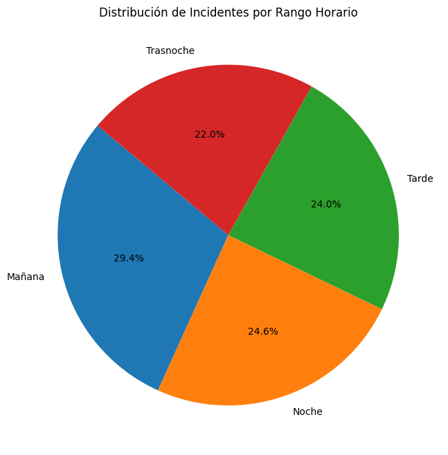
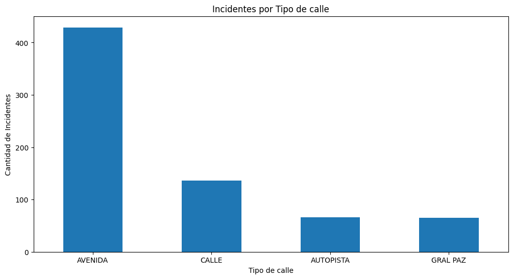
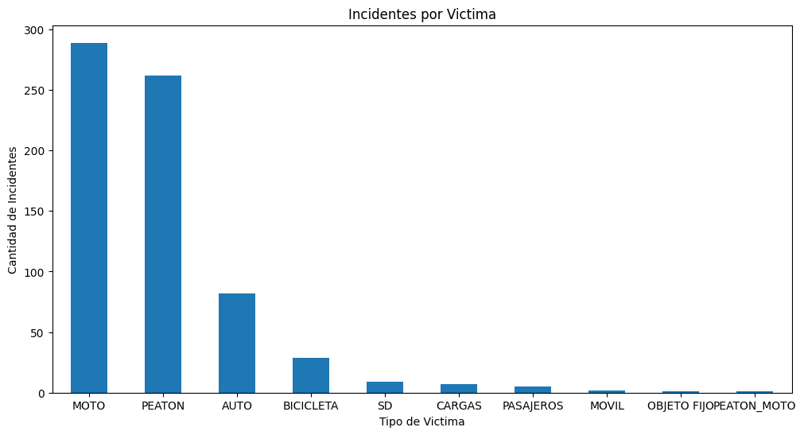
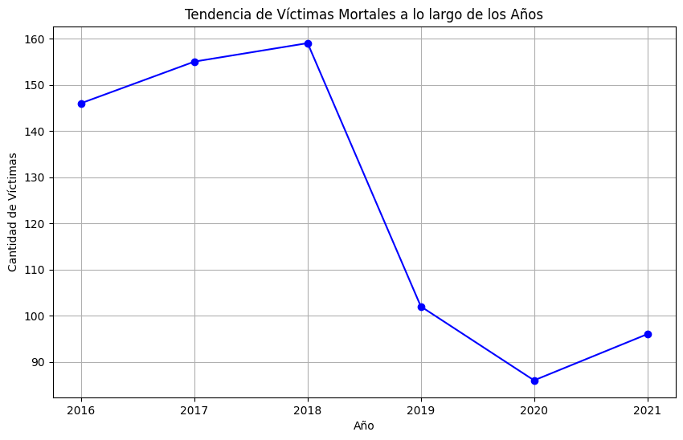

# Proyecto Individual Data Analyst

Siniestros viales

# Proyecto de Análisis de Siniestros viales en la Ciudad de Buenos Aires entre 2016 y 2021

Este proyecto tiene como objetivo realizar un análisis completo de un dataset que se encuentra en formato xlsx y contiene dos hojas llamadas: hechos y víctimas. Este proyecto incluye un proceso de ETL, un analisis exploratorio de datos EDA, la realizacion de un dashboard interactivo en Power Bi y la propuesta de tres KPIs en base a los datos obtenidos.

## Funcionalidades

El proyecto consta de las siguientes funcionalidades principales:

1. **ETL Inicial**: Se realiza una transformación de datos (ETL) en el dataset de hechos y victimas de homicidio para su posterior analisis.

2. **Análisis Exploratorio de Datos (EDA)**: Se lleva a cabo un análisis exploratorio de datos, del cual se obtienen conclusiones clave que se presentan en forma de gráficos.

3. **Visualizacion de datos en Power Bi**: Se crea un dashboard interactivo siguiendo un storytelling coherente. Incluye filtros y propuesta de KPIs.

4. **Exportacion de datos limpios**: Una vez completos los datos limpios se exportan en formato csv para poder ser procesados por Pandas en busca de discrepancias.

## EDA

Podemos ver en el siguiente grafico que la mayor cantidad de accidentes ocurridos en la Ciudad Autonoma de Buenos Aires son en la comuna 1. Esto es un hecho normal, ya que es el conocido Microcentro de Buenos Aires y una de las zonas mas concurridas diariamente.

Podemos ver en el siguiente grafico que en un plano general los accidentes pueden ocurrir en cualquier rango horario. Sin embargo, segun el analisis realizado, suele ser durante la mañana el momento donde mas se producen.

Con una amplia diferencia sobre el resto de tipos de calle podemos observar que las avenidas suelen ser las zonas donde mas accidentes se producen.

La mayor cantidad de victimas en siniestros viales en la ciudad de Buenos Aires son de Motociclistas, seguidos de Peatones. Esto a mi criterio es normal, debido a que muchas veces los peatones suelen ir distraidos a la hora de cruzar una calle y los motociclistas suelen aprovechar los espacios entre los autos para acelerar el viaje, dando como resultados accidentes.

Como podemos observar, hay una gran reduccion de los accidentes viales entre los años 2019 y 2021. Esto es debido principalmente por la pandemia del COVID-19 y la baja circulacion de vehiculos en esa epoca.

## Consideraciones

Para realizar la limpieza desde 0 se deben descomprimir los archivos de archivos_sin_limpiar.zip. Tuve que comprimirlos porque los json originales eran muy pesados para GitHub.
Hubo una enorme limpieza de datos ya que existian alrededor de 80000 filas nulas.

La API cuenta con 6 endpoints:

* userdata( User_id:str ): Se ingresa un id y devuelve la cantidad de dinero gastado por el usuario, el porcentaje de recomendación en base a reviews.recommend y cantidad de items.
* countreviews( YYYY-MM-DD y YYYY-MM-DD:str ): Cantidad de usuarios que realizaron reviews entre las fechas dadas y el porcentaje de recomendación positiva que hubo.
* genre( género:str ): Devuelve el puesto en el que se encuentra un género sobre el ranking de los mismos analizado bajo la columna PlayTimeForever.
* userforgenre( género:str ): Devuelve el top 5 de usuarios con más horas de juego en el género dado, con su URL (del user) y user_id.
* developer( desarrollador:str ): Devuelve año y porcentaje de contenido Free por año según empresa desarrolladora.
* sentiment_analysis( año:int ):  Según el año de lanzamiento, se devuelve una lista con la cantidad de registros de reseñas de usuarios que se encuentren categorizados con un análisis de sentimiento.

El parametro requerido para hacer funcionar el modelo mediante FastAPI es el ID del juego en base al dataframe de Steam. Siendo por ejemplo 730 = Counter Strike Global Offensive.
Para el Modelo de recomendacion se recortaron a 15000 la cantidad de datos en el dataframe principalmente porque render no permite utilizar mas de 512MB. Siendo que mi dataframe completo es de mas de 20000 filas pueden haber errores o valores faltantes a la hora de buscar un Id.
En caso de no utilizarlo en render y usarlo de forma local, simplemente eliminar la siguiente linea: df_encoded = df_encoded.head(15000). Linea 118 antes del modelo de recomendacion.

## Instalación y Uso

1. Clona este repositorio: `git clone https://github.com/FabianGonzalezz/ProyectoMLOPS14`
2. Instala las dependencias: `pip install -r requirements.txt`
3. Ejecuta la API con FastAPI: `uvicorn main:app --reload`

Si tienes preguntas o comentarios, puedes contactarme en [Gmail](mailto:fabiann.m.gonzalez@gmail.com) o a través de mi perfil de GitHub: [Github](https://github.com/FabianGonzalezz/).
