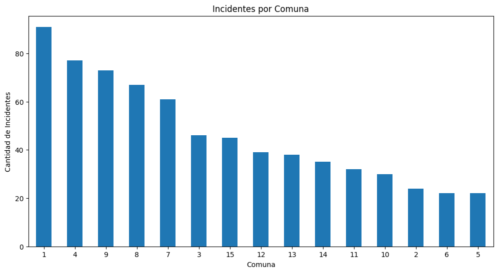

# Proyecto Individual Data Analyst

Siniestros viales

# Proyecto de Análisis de Siniestros viales en la Ciudad de Buenos Aires entre 2016 y 2021

Este proyecto tiene como objetivo realizar un análisis completo de un dataset que se encuentra en formato xlsx y contiene dos hojas llamadas: hechos y víctimas. Este proyecto incluye un proceso de ETL, un analisis exploratorio de datos EDA, la realizacion de un dashboard interactivo en Power Bi y la propuesta de tres KPIs en base a los datos obtenidos.

## Funcionalidades

El proyecto consta de las siguientes funcionalidades principales:

1. **ETL Inicial**: Se realiza una transformación de datos (ETL) en el dataset de hechos y victimas de homicidio para su posterior analisis.

2. **Análisis Exploratorio de Datos (EDA)**: Se lleva a cabo un análisis exploratorio de datos, del cual se obtienen conclusiones clave que se presentan en forma de gráficos.

3. **Visualizacion de datos en Power Bi**: Se crea un dashboard interactivo siguiendo un storytelling coherente. Incluye filtros y propuesta de KPIs.

4. **Exportacion de datos limpios**: Una vez completos los datos limpios se exportan en formato csv para poder ser procesados por Pandas en busca de discrepancias.

## EDA

Podemos ver en el siguiente grafico que la mayor cantidad de accidentes ocurridos en la Ciudad Autonoma de Buenos Aires son en la comuna 1. Esto es un hecho normal, ya que es el conocido Microcentro de Buenos Aires y una de las zonas mas concurridas diariamente.

Podemos ver en el siguiente grafico que en un plano general los accidentes pueden ocurrir en cualquier rango horario. Sin embargo, segun el analisis realizado, suele ser durante la mañana el momento donde mas se producen.

Con una amplia diferencia sobre el resto de tipos de calle podemos observar que las avenidas suelen ser las zonas donde mas accidentes se producen.

La mayor cantidad de victimas en siniestros viales en la ciudad de Buenos Aires son de Motociclistas, seguidos de Peatones. Esto a mi criterio es normal, debido a que muchas veces los peatones suelen ir distraidos a la hora de cruzar una calle y los motociclistas suelen aprovechar los espacios entre los autos para acelerar el viaje, dando como resultados accidentes.

Como podemos observar, hay una gran reduccion de los accidentes viales entre los años 2019 y 2021. Esto es debido principalmente por la pandemia del COVID-19 y la baja circulacion de vehiculos en esa epoca.

## KPIs

* Reducir en un 10% la tasa de homicidios en siniestros viales de los últimos seis meses, en CABA, en comparación con la tasa de homicidios en siniestros viales del semestre anterior
* Reducir en un 7% la cantidad de accidentes mortales de motociclistas en el último año, en CABA, respecto al año anterior
* Reducir en un 5% la cantidad de accidentes viales en la comuna 1 en el ultimo año, con respecto al año anterior

## Grafico KPIs

En el siguiente grafico podemos observar que el KPI se cumple solamente en los años 2019 y 2021. Y si bien en el resto de años no se cumple el KPI propuesto de reducir en un 10% la tasa de homicidios. Podemos ver que en una tendencia general son cada vez menos los accidentes de transito.

En este caso podemos ver que en 2017, 2019 y 2020 el KPI propuesto de reducir en un 7% la cantidad de accidentes de motociclistas fue alcanzado con exito. Sin embargo en 2021 se produce un incremento considerable de accidentes, lo cual es normal debido al fin de la pandemia de COVID-19 y la normal circulacion del transito.

Por ultimo podemos ver que el KPI se cumple tanto el años 2018, como 2019 y 2021. Siendo casi cumplido en 2020 tambien. Y si bien en 2017 no se cumplio podemos ver que, a pesar de no tener restricciones o problemas externos (como el COVID-19) desde ese año hay una reduccion considerable de accidentes en la comuna 1. Este KPI se decidio precisamente por ser la zona mas concurrida de CABA, donde trabajadores de todas partes de la provincia se reunen todos los dias para realizar su joranda laborarl.

## Consideraciones

1. En la carpeta src hay un csv llamado homicidiosactualizado.csv. En este archivo esta el dataset limpio que se utilizo para el dashboard de Power Bi.
2. El archivo homicidios.csv. Es el dataset antes de pasar por una segunda limpieza en Power Bi.
3. En el notebook main.ipynb se puede ver el proceso documentado por el cual se realizo la limpieza de datos y la creacion de los graficos y KPIs aqui propuestos.

Si tienes preguntas o comentarios, puedes contactarme en [Gmail](mailto:fabiann.m.gonzalez@gmail.com) o a través de mi perfil de GitHub: [Github](https://github.com/FabianGonzalezz/).
